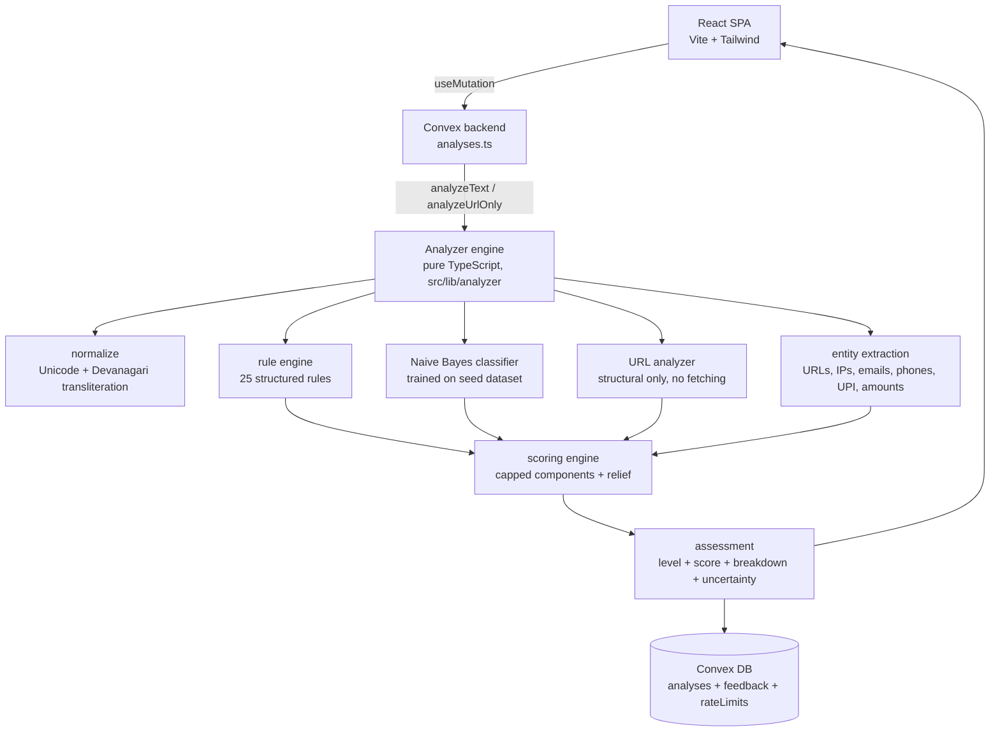

# Architecture

## System overview

## Layers

### 1. Normalization (`src/lib/analyzer/normalize.ts`)
- NFC normalization, zero-width character stripping, quote/dash unification.
- Devanagari → Roman transliteration (char-level map).
- Vocabulary word map (transliterated forms → Hinglish forms the rules expect), e.g. `rjistreshn → registration`.

### 2. Entity extraction (`entities.ts`)
Regex-based, Unicode-safe: URLs (http/www/bare domains), raw IPv4, emails, phones (10-digit/Indian formats), UPI handles, money amounts, script/language detection. Bare-IP links are typed `ip_url`.

### 3. Rule engine (`rules.ts`, `ruleEngine.ts`)
25 deterministic rules, each with `id`, `title`, `category`, `severity`, `weight`, `explanation`, `patterns[]`. Categories: financial, credentials, urgency, impersonation, job-scam, scholarship-scam, investment-scam, reward-scam, sensitive-data, contact, injection. Evidence is the **verbatim matched text** (up to 3 fragments/rule). One weak signal never condemns a message — weights are modest and per-component caps apply.

### 4. ML layer (`dataset.ts`, `classifier.ts`)
- Seed dataset: ~75 hand-written labeled examples — scam categories (job, phishing, payment, investment, scholarship, impersonation, injection) **plus hard legitimate negatives** (real interview invites, bill reminders, urgent work messages, Hinglish family/college messages, app-generated OTP notes).
- Multinomial Naive Bayes with Laplace smoothing, trained at load time.
- **Measured metrics**: stratified 5-fold cross-validation at load time; accuracy/precision/recall/F1/confusion matrix are computed, never invented.
- **Abstention**: prediction confidence is the margin from the 0.5 boundary; below 0.2 margin the scoring engine cuts the model's contribution to 25%.

### 5. URL analyzer (`urlAnalyzer.ts`)
Structural inspection only — **zero network requests, no SSRF surface by construction**: HTTPS presence, raw-IP hosts, subdomain depth ≥3, high-abuse TLDs, length, percent-encoding, punycode/homoglyph hosts, brand-name-in-unofficial-domain (with an official-domain allowlist), 20+ known shorteners, phishing keyword clusters, ≥8 query params, userinfo `@` trick. Verdicts: `safe_structurally | suspicious | dangerous | unverifiable`. External reputation is explicitly out of scope in v1 and reported as "Unable to verify".

### 6. Scoring engine (`scoring.ts`)

| Component | Cap | Notes |
|---|---|---|
| Rule engine | 55 | sum of triggered rule weights |
| ML classifier | 30 | probability × margin; reduced 75% below 0.2 margin |
| URL analysis | 32 | worst link verdict (safe 0 / unverifiable 8 / suspicious 20 / dangerous 32) |
| Entity risk | 15 | raw-IP link +8, payment handle +7, phone+amount +3 |
| Legitimacy relief | 18 | strong model-legitimate evidence pulls score down |

Final = clamped sum → 0–100. Levels: LOW < 30 ≤ MEDIUM < 55 ≤ HIGH < 75 ≤ CRITICAL. `INSUFFICIENT EVIDENCE` overrides LOW for very short inputs with no strong signals. Every result carries per-component points/raw/cap plus uncertainty notes.

### 7. Backend (`src/convex/`)
- `analyses` — one row per analysis: owner, kind, truncated input preview, URLs, risk level/score, full serialized result, model + analyzer versions, timestamp.
- `feedback` — correct / incorrect / not_sure + optional comment; stored for future evaluation only, **never auto-retrains**.
- `rateLimits` — fixed-window counter, 20 analyses/min/user.
- All access authenticated via Convex Auth; ownership checked on every read/write.

## Extension points (v2)
- Screenshot/OCR: add an `image` kind; run OCR then feed extracted text into `analyzeText` (already Unicode-safe).
- Transformer classifier: replace `predictText` internals — the interface (`scamProbability`, `confidence`, token explanations) is stable.
- Reputation APIs: add an `external` verification source behind the `UrlAnalysisResult.verification` field.